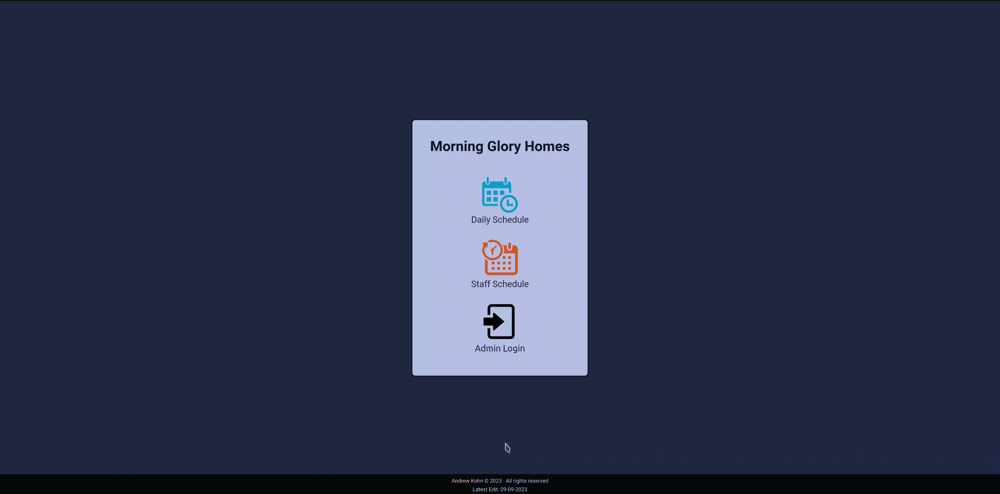
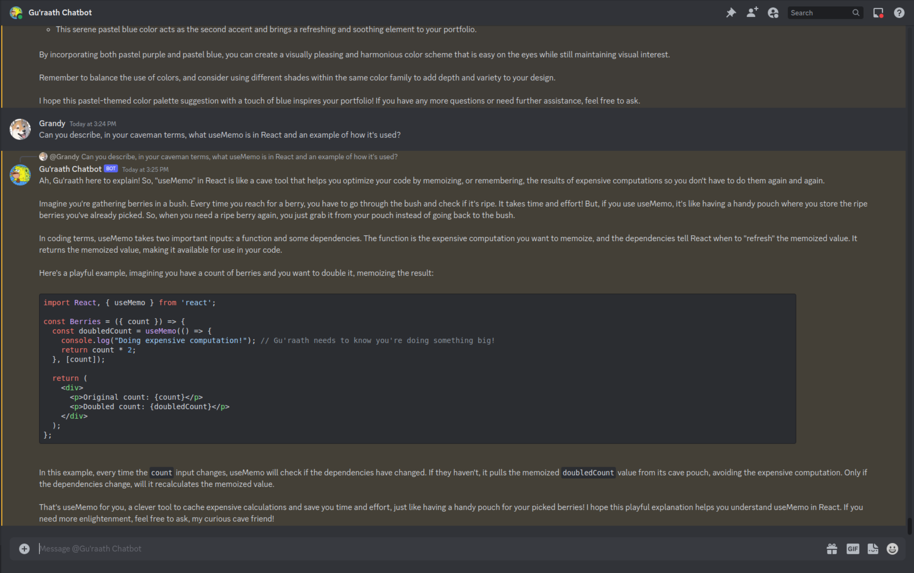
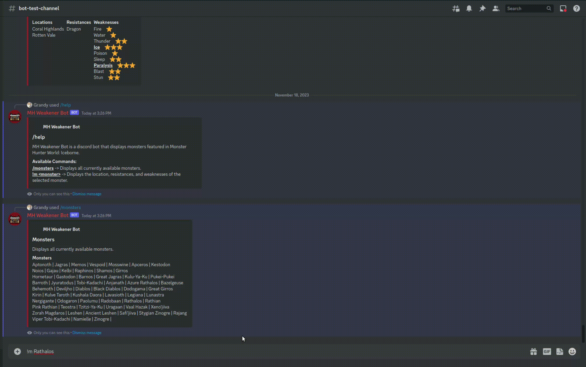

  <a target="_blank" href="https://kohnandrew.com/">Portfolio Site</a>

#

<h2 align="center">Projects</h2>
<table bordercolor="#66b2b2">
  <tr>
    <td width="50%" valign="top">
      <h3 align="center">MGH Daily Schedule</h3>
       
      

        
      

       
      

        
        
        
        
        
        
        
        
      

       
      
Shows night/day shift daily schedules as well as the monthly schedule. Information is gathered through a MySQL database and allowed users can post and/or update both daily and monthly schedules. The live-demo utilizes an example database for showcasing and to maintain HIPAA.

      

        <a href="https://github.com/AndrewKohn/mgh-daily-schedule" target="_blank">
          Repo
        </a>
        <!-- &nbsp;&nbsp;
        <a href="https://github.com/AndrewKohn/mgh-daily-schedule" target="_blank">
          Live Demo
        </a> -->
      

       
    </td>
    <td width="50%" valign="top">
      <h3 align="center">GPT Discord Bot</h3>
       
      

        
      

       
      

        
        
      

       
      
A ChatGPT discord chatbot utilizing OpenAI's API with the ability to converse with multiple users within the server's channel & can respond to DM's. To make it a bit interesting, the chatbot is role-playing as a caveman that values family-values and he also works in a call center for ChatGPT in the US.

      

        <a href="https://github.com/AndrewKohn/gpt-discord-bot" target="_blank">
          Repo
        </a>
        &nbsp;&nbsp;
        <a href="https://discord.com/invite/c27D5CXkA5" target="_blank">
          Live Demo
        </a>
      

       
    </td>
  </tr>
  <tr>
    <td width="50%" valign="top">
      <h3 align="center">O(n)otes</h3>
       
      

        
      

       
      

        
        
        
        
        
        
        
      

       
      
Displays markdown notes from my obsidian app.

      

        <a href="https://github.com/AndrewKohn/obsidian-notes" target="_blank">
          Repo
        </a>
        <!-- &nbsp;&nbsp;
        <a href="https://github.com/AndrewKohn/obsidian-notes" target="_blank">
          Live Demo
        </a> -->
      

       
    </td>
    <td width="50%" valign="top">
      <h3 align="center">MH Discord Bot</h3>
       
      

        
      

       
      

        
        
      

       
      
A discord bot that shows a brief overview of a monster's location, resistances, and weaknesses and any special conditions, if any. Allows user and friends to be on the same page and to quickly optimize for a fight.

      

        <a
          href="https://github.com/AndrewKohn/mh-weakener-discord-bot"
          target="_blank"
        >
          Repo
        </a>
        &nbsp;&nbsp;
        <a
          href="https://discord.com/invite/S5kHXjZfjJ"
          target="_blank"
        >
          Live Demo
        </a>
      

       
    </td>
  </tr>
</table>

  </tr>
</table>

  
<h3>📊 Stats</h3>

   
  

    
  

  
<h3>🧰 Tools</h3>

   
  

    <dl>
      <dd>
        &nbsp;&nbsp;
        <code
          ></code>
        &nbsp;
        <code
          ></code>
        &nbsp;
        <code
          ></code>
        &nbsp;
        <code
          ></code>
        &nbsp;
        <code
          ></code>
        &nbsp;
        <code
          ></code>
        &nbsp;
        <code
          ></code>
        &nbsp;
        <code
          ></code>
          
        &nbsp;&nbsp;
        <code
          ></code>
        &nbsp;
        <code
          ></code>
        &nbsp;
        <code
          ></code>
        &nbsp;
        <code
          ></code>
        &nbsp;
        <code
          ></code>
        &nbsp;
        <code
          ></code>
        &nbsp;
        <code
          ></code>
        &nbsp;
        <code
          ></code>
          
        &nbsp;&nbsp;
        <code
          ></code>
        &nbsp;
        <code
          ></code>
        &nbsp;
        <code
          ></code>
        &nbsp;
        <code
          ></code>
        &nbsp;
        <code
          ></code>
        &nbsp;
        <code
          ></code>
      </dd>
    </dl>
  

   

